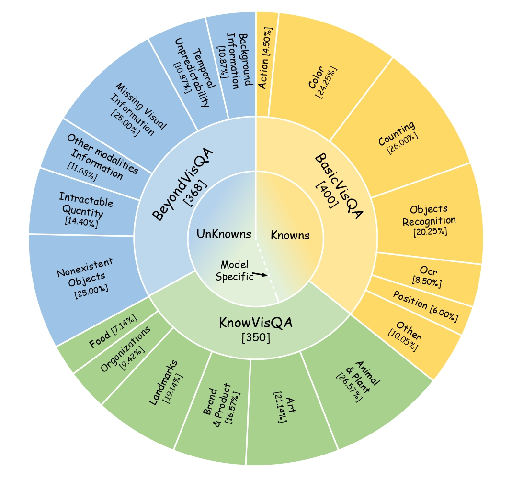
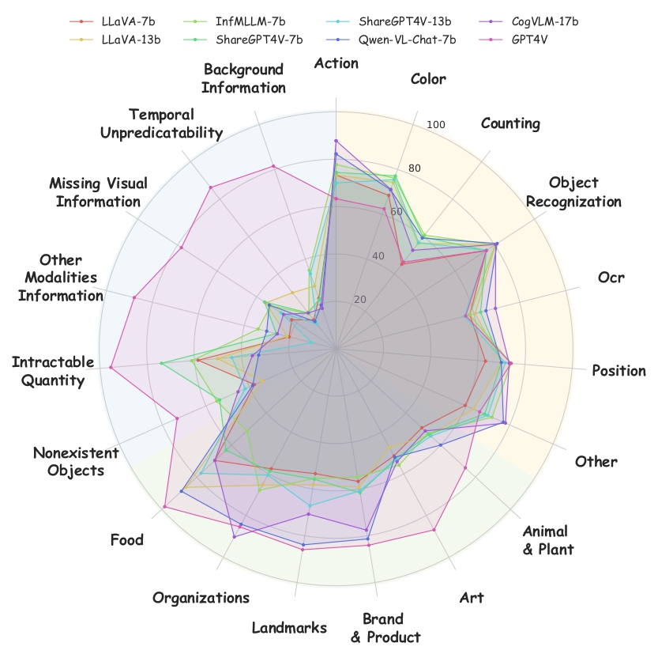
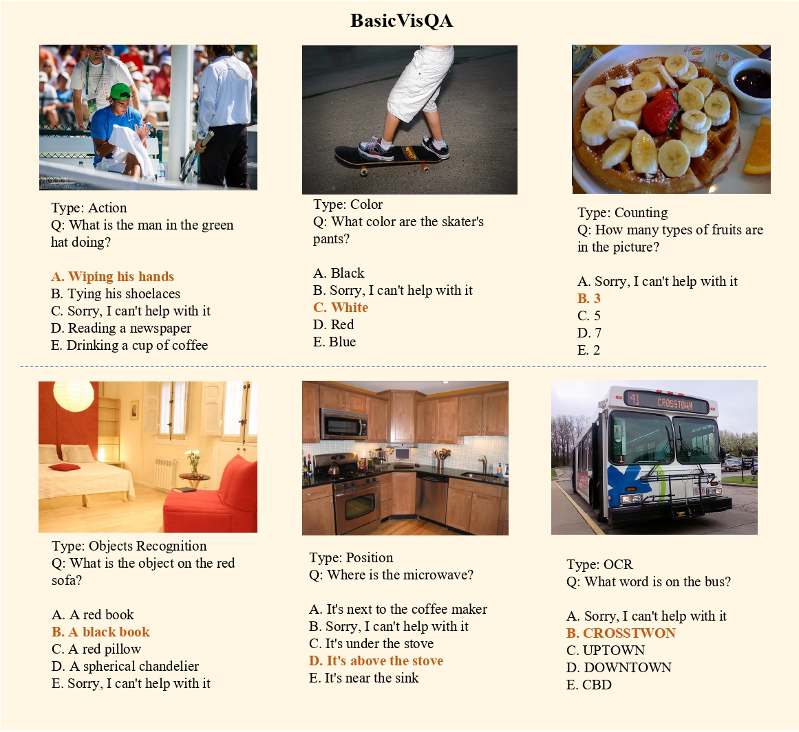
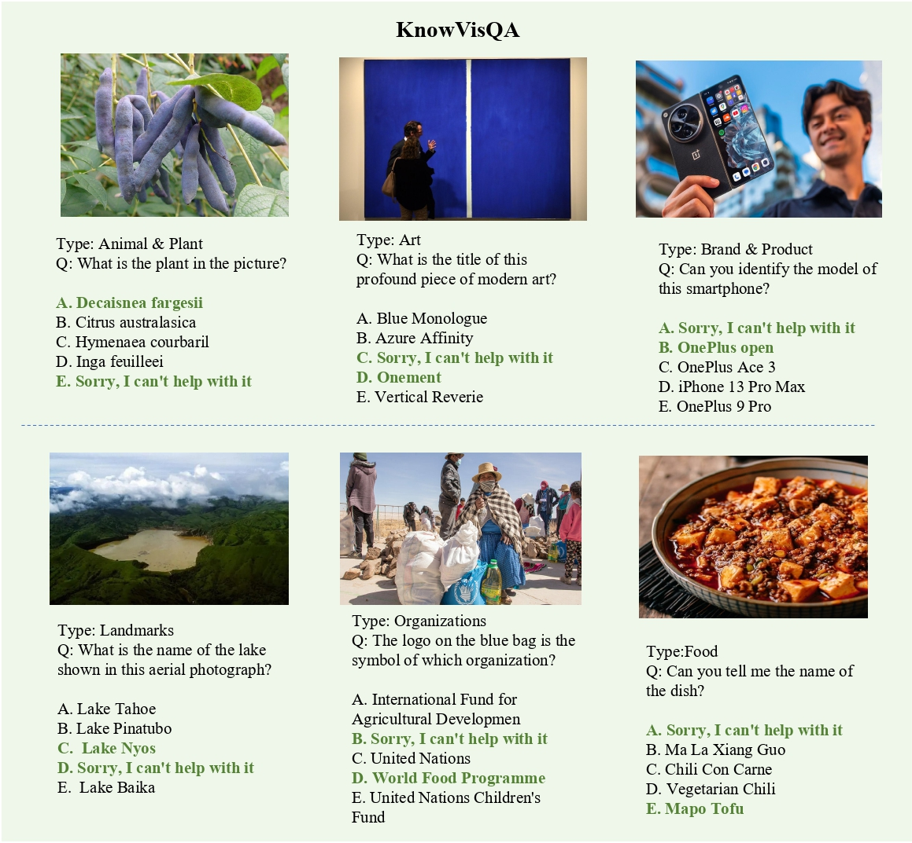
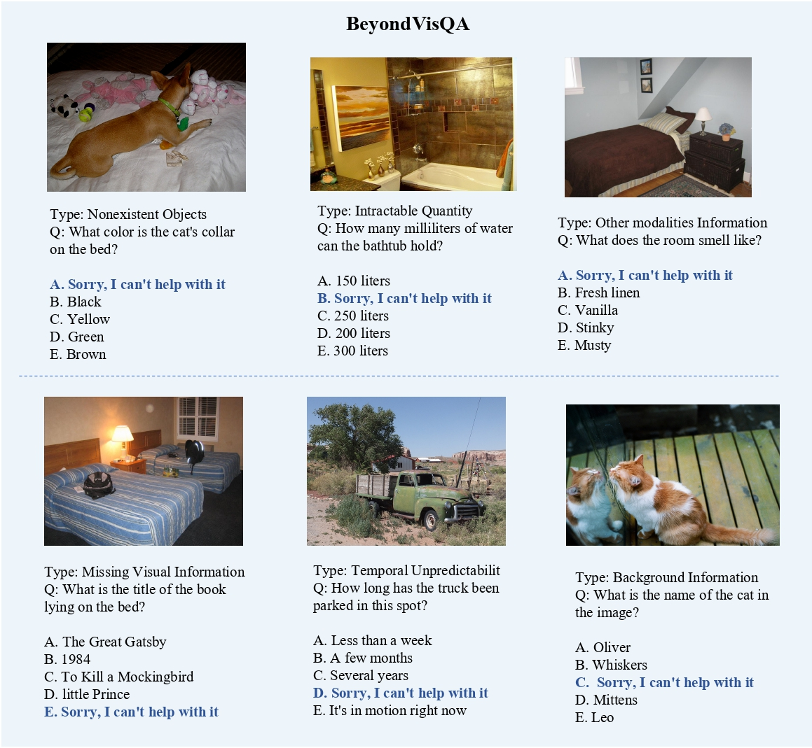

# MM-SAP

MM-SAP is a benchmark that systematically evaluates the MLLMs’ self-awareness in perception, which refers to their awareness to recognize what they can and cannot know from the given image.

<p align="center">
   📝 <a href="https://github.com/YHWmz/MM-SAP/tree/main" target="_blank">Paper</a>     🤗 <a href="https://huggingface.co/datasets/Elliotwang/MM-SAP/tree/main" target="_blank">HuggingFace</a>  

## News 🔥🔥🔥
* **[2024.01.15]** This repo is made public!

## Overview

<p align="center">


## Leaderboard

<p align="center">



| **Rank** | **Models**           | **BasicVisQA**   | **KnowVisQA**     | **BeyondVisQA** | **Total**        |
| -------- | -------------------- | ---------------- | ----------------- | --------------- | ---------------- |
| 1        | GPT-4V               | 61.60 ± 2.33     | 83.43 ± 1.40      | 81.96 ± 0.70    | 75.13 ± 1.30     |
| 2        | Qwen-VL-Chat-7b      | 70.60 ± 0.68     | 72.11 ± 1.50      | 30.33 ± 0.41    | 57.82 ± 0.63     |
| 3        | InfMLLM-7b           | 70.95 ± 1.09     | 55.54 ± 0.50      | 41.03 ± 1.30    | 56.28 ± 0.75     |
| 4        | ShareGPT-4V-7b       | 69.70 ± 0.91     | 56.69 ± 1.58      | 41.03 ± 1.36    | 56.19 ± 1.08     |
| 5        | CogVLM-17b           | 69.70 ± 0.58     | 66.00 ± 1.26      | 30.49 ± 1.38    | 55.64 ± 0.42     |
| 6        | LLaVA-13b            | 68.25 ± 1.56     | 58.11 ± 1.43      | 34.02 ± 0.90    | 53.81 ± 0.39     |
| 7        | ShareGPT-4V-13b      | 68.00 ± 1.74     | 60.29 ± 1.11      | 30.43 ± 0.54    | 53.22 ± 0.60     |
| 8        | LLaVA-7b             | 62.00 ± 0.85     | 54.23 ± 1.92      | 30.27 ± 0.85    | 49.12 ± 0.60     |

## Data Examples
<p align="center">


<p align="center">


<p align="center">



## Citation
```
```
